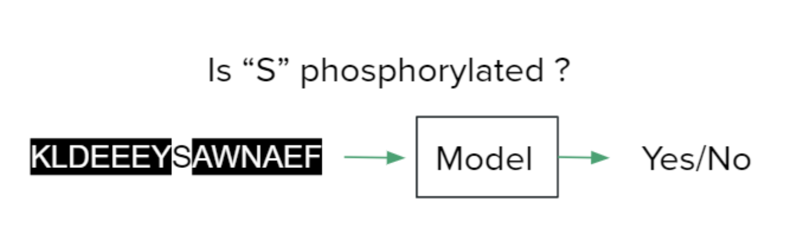
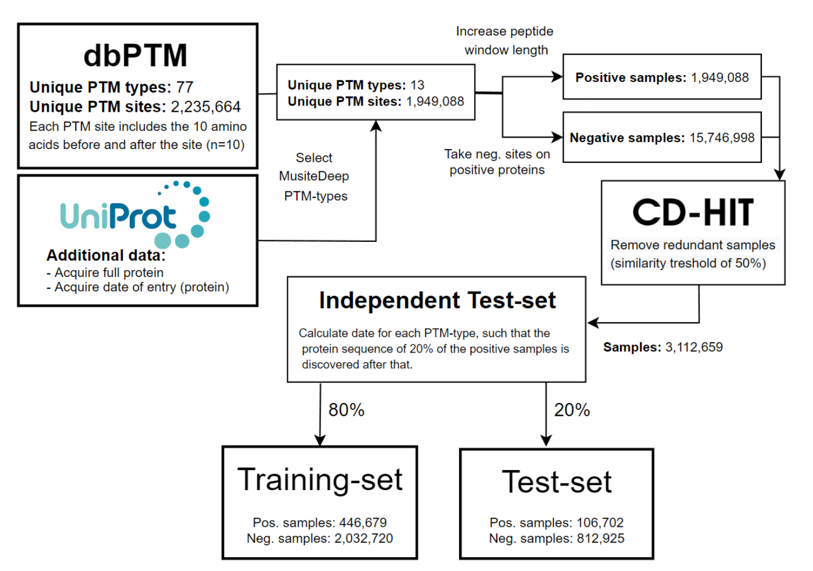
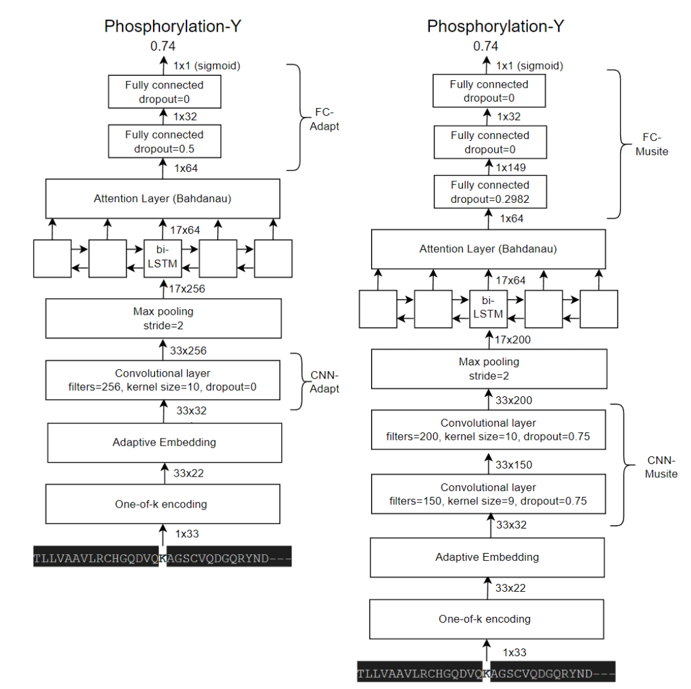

# PTM Site Prediction: Deep learning

This repository contains ALL code that is used in the making of the paper:  
*Utilizing pre-trained protein models and a
species feature to improve post-translation
modification site prediction.*  
[Link to paper](https://drive.google.com/file/d/1aOGB4fK3wnpZVyYjkSlnxT449-w555v5/view?usp=sharing)  
This includes the code to create the dataset, the deep-learning models, training loops and code to generate the figures as used in the paper. The full processed dataset can be requested.

## Dataset Processing

All code used in the processing steps as shown in the above figure, is present in the different python scripts in *dataset/*

## Deep Learning Models \& Training Loop

All implemented architectures and used layers in the paper are implemented in *learning/models/*. This is including the pictured architectures in the above figure. The training loop itself can be found in *learning/train.py*